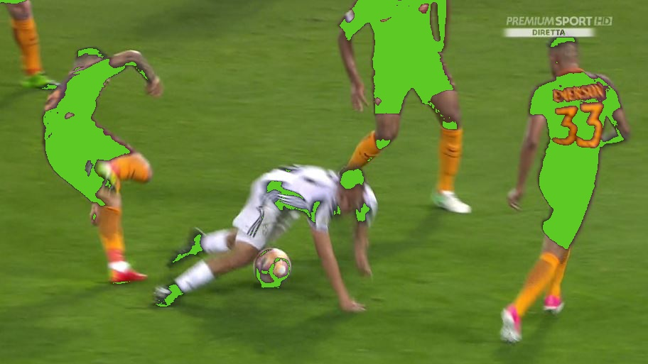
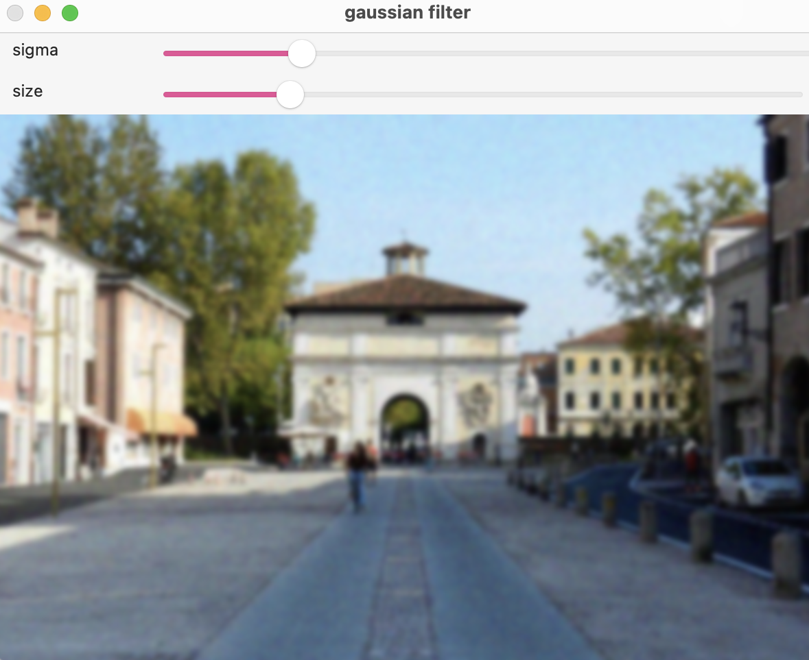
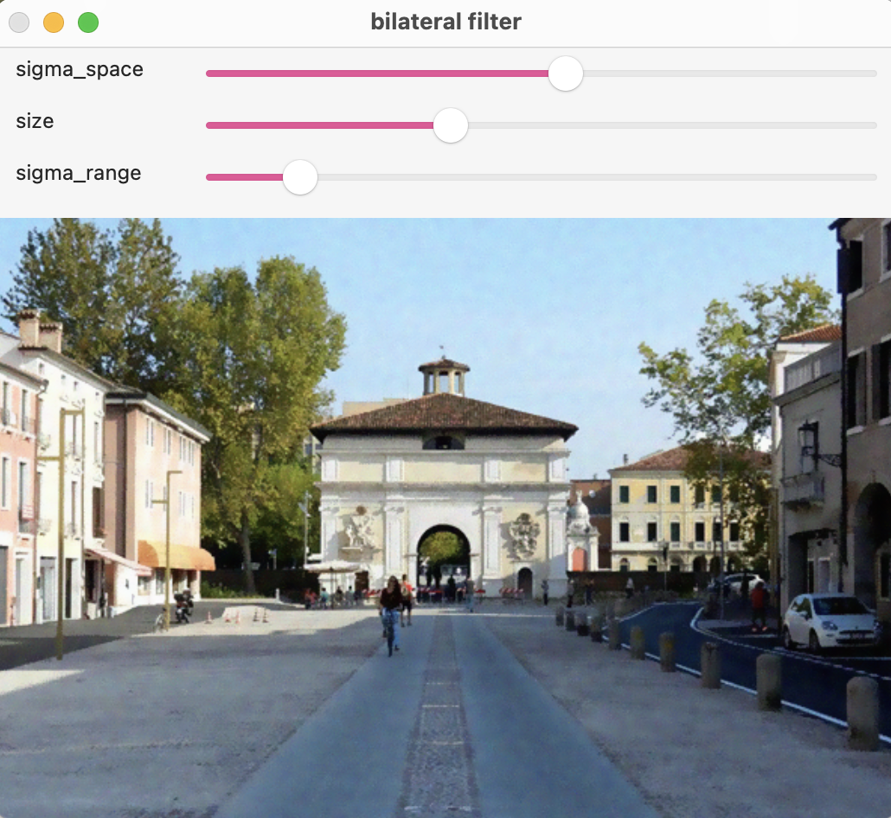

# Computer Vision algorithms

We provide the solution to different Computer Vision problems solved with OpenCV. Since this repository is realized following the path of the [Computer Vision course](https://didattica.unipd.it/off/2020/LM/IN/IN2371/004PD/INP9087844/N0) @ University of Padua, the algorithms proposed go from a basic "getting started" with OpenCV to more advanced examples.

Each folder contains a project, use the following commands to compile and run it:
```
make
./main
```

## Overview
### Segmenting images by means of a thresholding algorithm
To get familiar with OpenCV, we start with a simple thresholding algorithm, implemented in [segmenting_threshold](https://github.com/nicolezattarin/Computer-Vision/tree/main/segmenting_threshold).

The main program, given an image and a set of thresholds, one for each BGR channel, works as follows:
1. Shows the image on a window;
2. Captures the left click of the mouse and computes the mean RGB color over a square of size 9x9 pixels centered on the left click;
3. Segments the mean color selected by applying a static threshold to the three channels R, G and B;
4. Applies a new color to the selected regions (we use BGR = (37,201,92)).

An example running the code with `./main roma.jpeg 50 50 50`:
<p float="center">
  
  
</p>
### Histogram equalization
In [histogram_equalization](https://github.com/nicolezattarin/Computer-Vision/tree/main/histogram_equalization) we implement a histogram equalization algorithm in RGB and BGR2HSV color spaces.

Given an image, the program computes the histogram of each channel of the image, in order to and apply equalization to the three channels independently in the case of RGB and to the last channel for what concerns BGR2HSV.
We plot the histograms of the original image, the equalized image and save the result in a new folder.

An example follows: original photo, RGB equalization  HSV equalization 

<p float="center">
  
  
   
</p>


### Filtering
In [filtering](https://github.com/nicolezattarin/Computer-Vision/tree/main/filtering) we provide an API and a test code to perform median, gaussian and bilateral filtering of a given image. Parameters can be tuned by means of trackbars once the image is shown.

An example of interface follows:
<p float="center">
  
  
   
</p>


